# Architecture Diagrams

**System:** LSTM Frequency Extraction System
**Version:** 1.0
**Date:** November 13, 2025

This document contains formal C4 and UML diagrams following industry standards.

**Rendering:** These diagrams use Mermaid and PlantUML syntax. View on GitHub or use:
- [Mermaid Live Editor](https://mermaid.live/)
- [PlantUML Online](http://www.plantuml.com/plantuml/uml/)

---

## Table of Contents

1. [C4 Model Diagrams](#c4-model-diagrams)
2. [UML Class Diagrams](#uml-class-diagrams)
3. [UML Sequence Diagrams](#uml-sequence-diagrams)
4. [Component Diagrams](#component-diagrams)
5. [Deployment Diagram](#deployment-diagram)

---

## C4 Model Diagrams

### Level 1: System Context Diagram

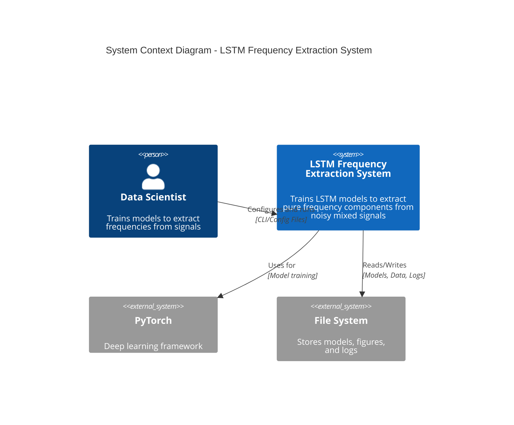

### Level 2: Container Diagram

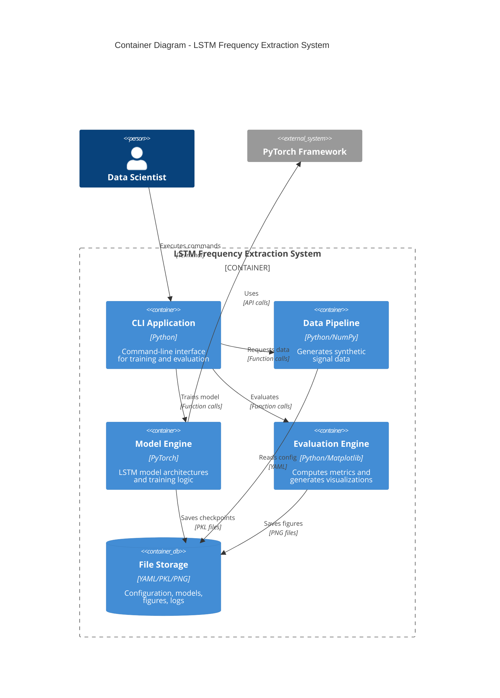

### Level 3: Component Diagram

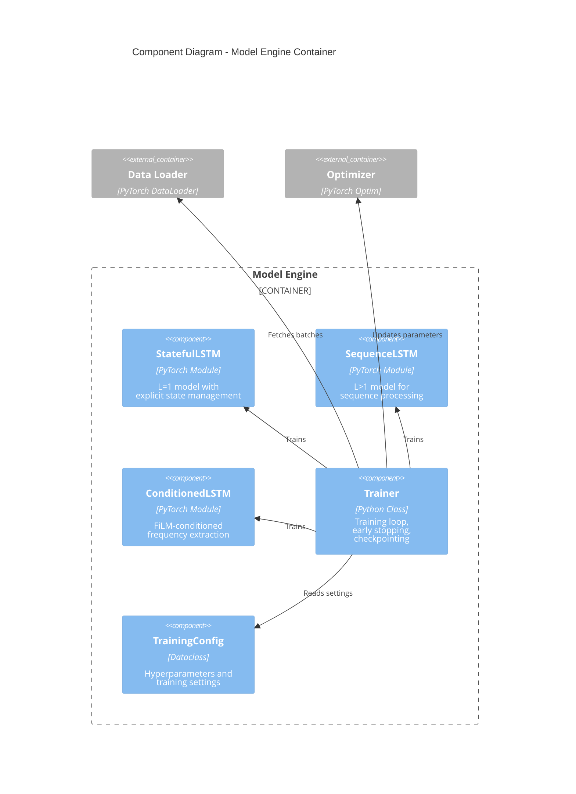

---

## UML Class Diagrams

### Core Model Architecture

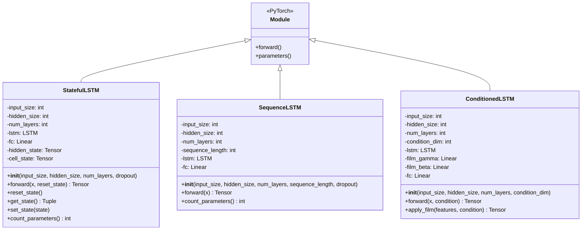

### Data Pipeline Classes

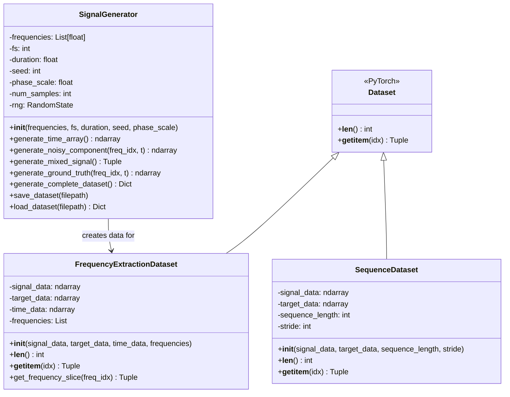

### Training Components

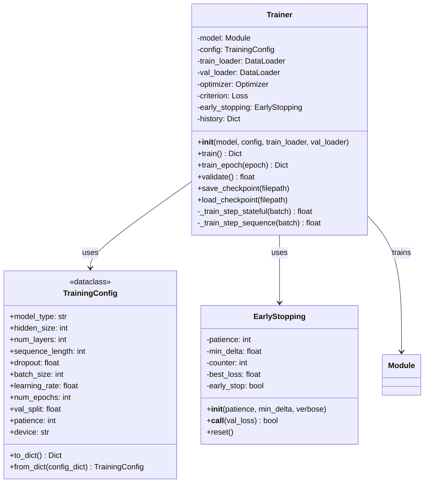

### Evaluation System

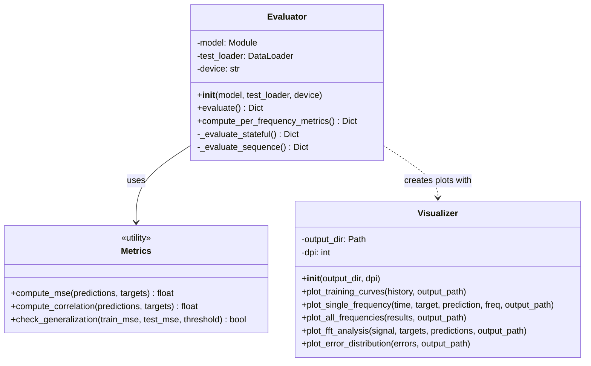

---

## UML Sequence Diagrams

### Training Sequence (L=1 Stateful)

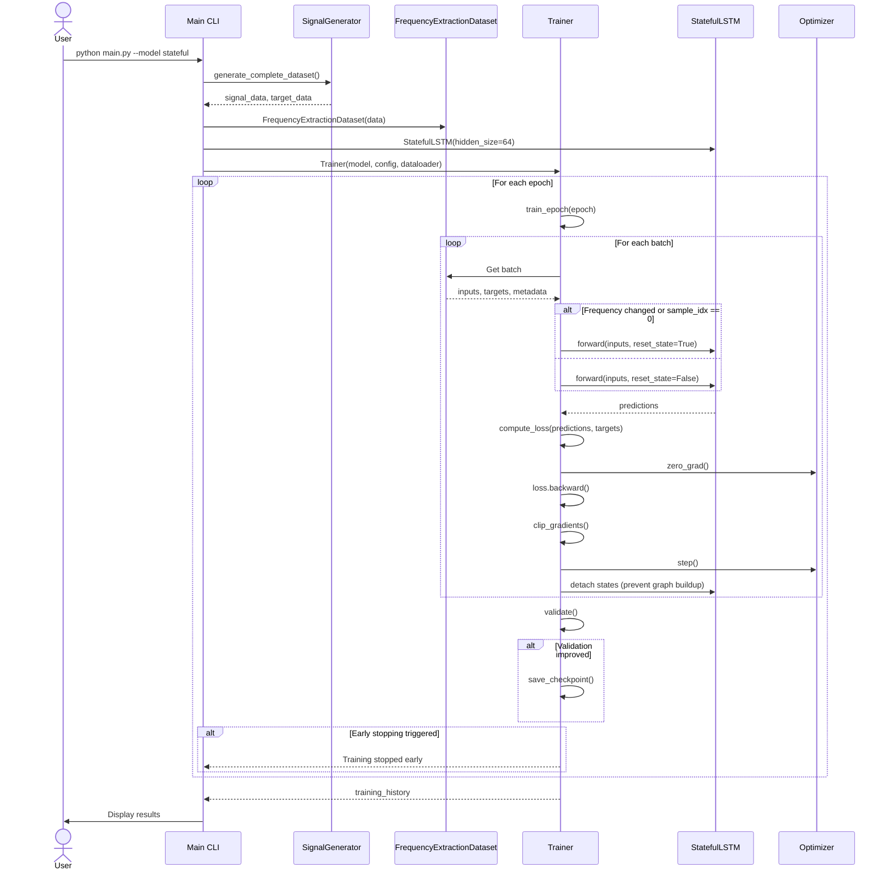

### Evaluation Sequence

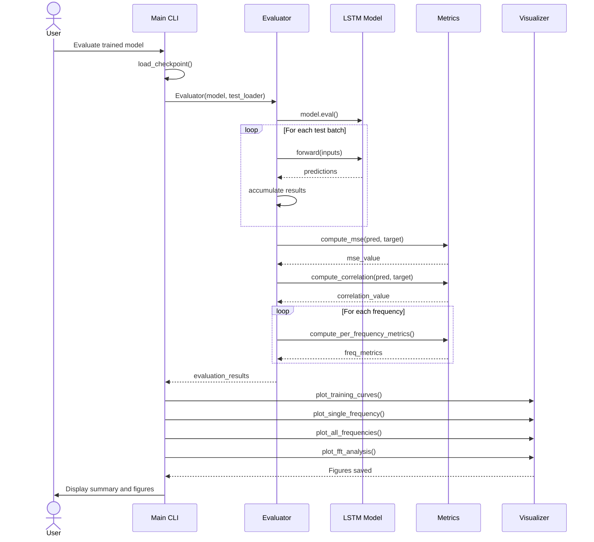

### Configuration Loading Sequence

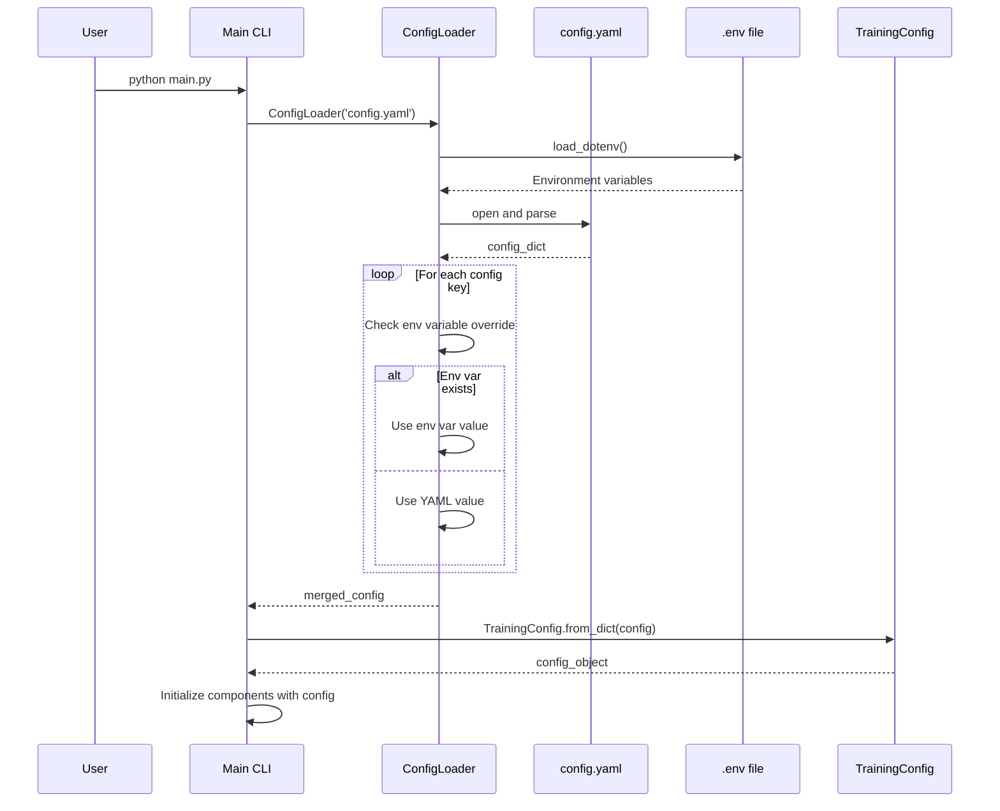

---

## Component Diagrams

### System Component Architecture

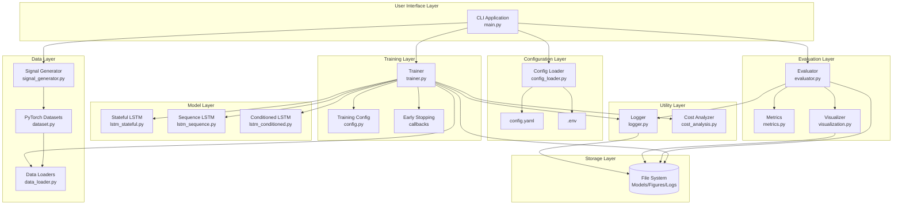

---

## Deployment Diagram

### Local Development/Training Deployment

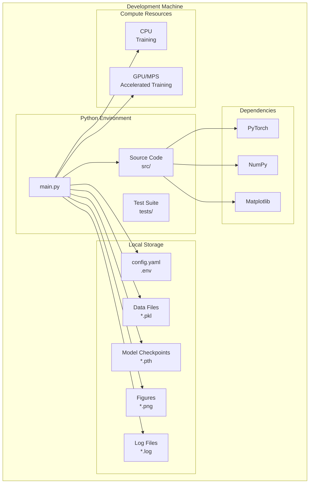

---

## Data Flow Diagram

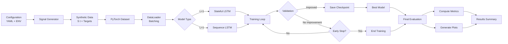

---

## Legend

### C4 Model Elements

- **Person**: External user or actor
- **System**: Software system boundary
- **Container**: Deployable unit (application, service, database)
- **Component**: Grouping of related functionality

### UML Elements

- **Class**: Object-oriented class definition
- **Interface**: Contract specification
- **Association**: Relationship between classes
- **Inheritance**: Parent-child relationship
- **Dependency**: Uses relationship

### Diagram Conventions

- **Solid Line**: Direct dependency
- **Dashed Line**: Indirect dependency
- **Arrow**: Direction of dependency
- **Diamond**: Composition/Aggregation

---

**Note**: These diagrams can be rendered using:
- GitHub (automatic Mermaid rendering)
- Mermaid Live Editor: https://mermaid.live/
- VS Code with Mermaid extension
- PlantUML Online: http://www.plantuml.com/plantuml/uml/

**Last Updated:** November 13, 2025
